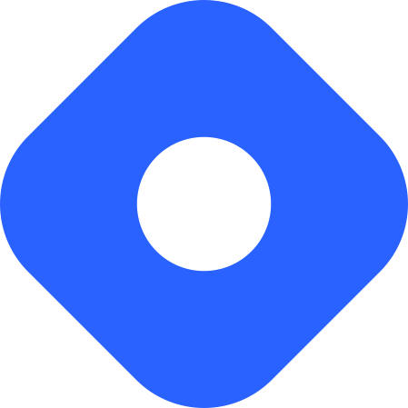

<html>
    <!-- We cannot use CSS anywhere in this page, because the GitHub main repo doesn't render it. CSS is fine within the other docs pages though. -->
    <div align="center">
        
        <h3>
          Derived Data Platform for Planet-Scale Workloads<br/>
        </h3>
        <div>
            <!-- N.B.: We've got to leave no spaces within the <a href> tag otherwise we get blue link underlines inbetween the icons on the GitHub repo's main page (though not in the Just The Docs website). -->
            <a href="https://blog.venicedb.org/stable-releases"></a>
            <a href="https://github.com/linkedin/venice/actions?query=branch%3Amain"></a>
            <a href="https://venicedb.org/"></a>
        </div>
        <div>
            <a href="https://github.com/linkedin/venice"></a>
            <a href="https://www.linkedin.com/company/venicedb/"></a>
            <a href="https://twitter.com/VeniceDataBase"></a>
            <a href="http://slack.venicedb.org"></a>
        </div>
    </div>
</html>

Venice is a derived data storage platform, providing the following characteristics:

1. High throughput asynchronous ingestion from batch and streaming sources (e.g.
   [Hadoop](https://github.com/apache/hadoop) and [Samza](https://github.com/apache/samza)).
2. Low latency online reads via remote queries or in-process caching.
3. Active-active replication between regions with CRDT-based conflict resolution.
4. Multi-cluster support within each region with operator-driven cluster assignment.
5. Multi-tenancy, horizontal scalability and elasticity within each cluster.

The above makes Venice particularly suitable as the stateful component backing a Feature Store, such as
[Feathr](https://github.com/feathr-ai/feathr). AI applications feed the output of their ML training jobs into Venice and
then query the data for use during online inference workloads.

# Overview

Venice is a system which straddles the offline, nearline and online worlds, as illustrated below.


## Dependency

You can add a dependency on Venice to any Java project as specified below. Note that, currently, Venice dependencies are
not published on Maven Central and therefore require adding an extra repository definition. All published jars can be
seen [here](https://linkedin.jfrog.io/ui/native/venice/com/linkedin/venice/). Usually, the project is released a few
times per week.

### Gradle

Add the following to your `build.gradle`:

```groovy
repositories {
  mavenCentral()
  maven {
    name 'VeniceJFrog'
    url 'https://linkedin.jfrog.io/artifactory/venice'
  }
}

dependencies {
  implementation 'com.linkedin.venice:venice-client:0.4.455'
}
```

### Maven

Add the following to your `pom.xml`:

```xml
<project>
...
  <repositories>
    ...
    <repository>
      <id>venice-jfrog</id>
      <name>VeniceJFrog</name>
      <url>https://linkedin.jfrog.io/artifactory/venice</url>
    </repository>
  </repositories>
...
  <dependencies>
    ...
    <dependency>
      <groupId>com.linkedin.venice</groupId>
      <artifactId>venice-client</artifactId>
      <version>0.4.455</version>
      <scope>compile</scope>
    </dependency>
  </dependencies>
</project>

```

## APIs

From the user's perspective, Venice provides a variety of read and write APIs. These are fully decoupled from one
another, in the sense that no matter which write APIs are used, any of the read APIs are available.

Furthermore, Venice provides a rich spectrum of options in terms of simplicity on one end, and sophistication on the
other. It is easy to get started with the simpler APIs, and later on decide to enhance the use case via more advanced
APIs, either in addition to or instead of the simpler ones. In this way, Venice can accompany users as their
requirements evolve, in terms of scale, latency and functionality.

The following diagram presents these APIs and summarizes the components coming into play to make them work.


### Write Path

Venice supports flexible data ingestion:

- **Batch Push**: Full dataset replacement from Hadoop, Spark
- **Incremental Push**: Bulk additions without full replacement
- **Streaming Writes**: Real-time updates via Kafka, Samza, Flink, or the
  [Online Producer](./user-guide/write-apis/online-producer.md)
- **Write Compute**: Partial updates and collection merging for efficiency
- **Hybrid Stores**: Mix batch and streaming with configurable rewind time

### Read Path

Venice provides multiple read APIs and client options:

**Read APIs**:

- Single get, batch get
- Read compute with server-side operations (dot product, cosine similarity, field projection)

**Client Types**:

- **Thin Client**: Stateless, 2 network hops, < 10ms latency
- **Fast Client**: Partition-aware, 1 network hop, < 2ms latency
- **Da Vinci Client**: Stateful local cache, 0 network hops, < 1ms latency

All clients share the same APIs, enabling flexible cost/performance optimization without code changes.

**Change Data Capture (CDC)**: Stream all data changes (inserts, updates, deletes) for use cases like ML feature
retrieval and client-side indexing.

---

For a comprehensive guide to Venice's architecture, write modes, client characteristics, and capabilities, see the
[Architecture Overview](./getting-started/learn-venice/architecture-overview.md).

## Resources

The _Open Sourcing Venice_
[blog](https://engineering.linkedin.com/blog/2022/open-sourcing-venice--linkedin-s-derived-data-platform) and
[conference talk](https://www.youtube.com/watch?v=pJeg4V3JgYo) are good starting points to get an overview of what use
cases and scale can Venice support. For more Venice posts, talks and podcasts, see our
[Learn More](./resources/learn-more.md) page.

### Getting Started

Refer to the [Venice quickstart](./getting-started/index.md) to create your own Venice cluster and play around with some
features like creating a data store, batch push, incremental push, and single get. We recommend sticking to our latest
[stable release](https://blog.venicedb.org/stable-releases).

### Community

Feel free to engage with the community using our:

<!-- N.B.: The links are duplicated here between the icon and text, otherwise the blue link underline extends into the space, which does not look good. -->

- [](http://slack.venicedb.org)
  [Slack workspace](http://slack.venicedb.org)
  - Archived and publicly searchable on [Linen](http://linen.venicedb.org)
- [](https://www.linkedin.com/groups/14129519/)
  [LinkedIn group](https://www.linkedin.com/groups/14129519/)
- [](https://github.com/linkedin/venice/issues)
  [GitHub issues](https://github.com/linkedin/venice/issues)
- [](./contributing/index.md)
  [Contributor's guide](./contributing/index.md)

Follow us to hear more about the progress of the Venice project and community:

- [](https://blog.venicedb.org) [Blog](https://blog.venicedb.org)
- [](https://bsky.app/profile/venicedb.org)
  [Bluesky handle](https://bsky.app/profile/venicedb.org)
- [](https://www.linkedin.com/company/venicedb)
  [LinkedIn page](https://www.linkedin.com/company/venicedb)
- [](https://x.com/VeniceDataBase)
  [X handle](https://x.com/VeniceDataBase)
- [](https://youtube.com/@venicedb)
  [YouTube channel](https://youtube.com/@venicedb)
