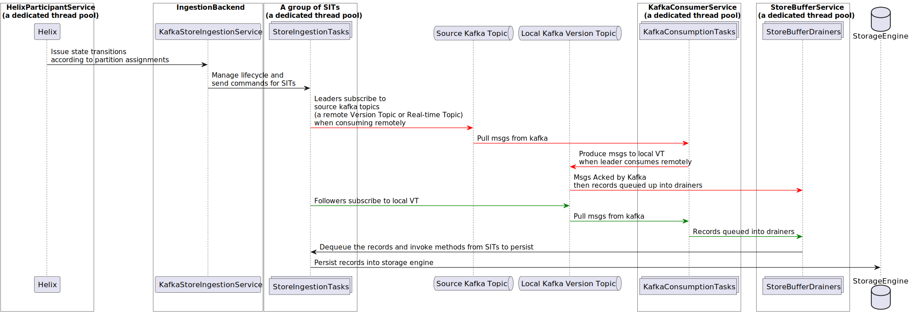

# Introduction

As a high performance derived data storage platform, Venice is designed to ingest large amount of writes from a variety 
of sources while providing low latency read access to the data. These characteristics are achieved by a combination of
design choices and optimizations in the write path. This document describes some internal details of the Venice write path. 

Note that this page is still under construction and only provides glimpses of the Venice writing path. More details will 
be added in the future.

### Terminology

| Name  | Description                                                                                                 |
|-------|-------------------------------------------------------------------------------------------------------------|
| VT    | Version Topic. The version topic is a kafka topic where holds all the data for a given store.               |
| RT    | Real time Topic. A real time topic is also a kafka topic but it only contains data from nearline producers. |
| ZK    | Apache ZooKeeper. It's used in multiple Venice components to persist Venice metadata.                       |
| Helix | Apache Helix. It's used in Venice to manage the cluster and assign partitions to different servers.         |
| EV    | Helix External View. Venice uses it to represent the state of a server in a leader/follower mode.           |
| CV    | Helix Customized View. Venice uses it to represent the ingestion state of a server for a given store.       |

### Venice Store Ingestion on server side

In Venice, a table or the dataset is called a store and each store has multiple partitions. Helix assign leaders and
followers status on each partition to different servers. When assignments are done, each server will create multiple
`StoreIngestionTask`s to handle ingestion for the partitions it's assigned to. The diagram belows describes the data flow of how a 
store ingestion task's created and ingest data on the server side.

### Venice Store Ingestion report 

When ingestion is in different stages, the server reports the ingestion status. The ingestion signal is propagated to 
various downstream for different business logics. The diagram below describes the signal flow of the ingestion report.

