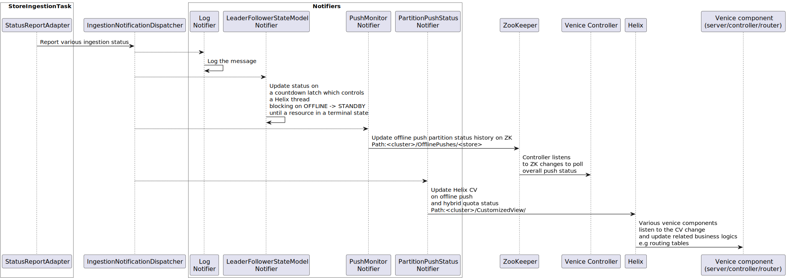

# Introduction

As a high performance derived data storage platform, Venice is designed to ingest large amount of writes from a variety 
of sources while providing low latency read access to the data. These characteristics are achieved by a combination of
design choices and optimizations in the write path. This document describes some internal details of the Venice write path. 

Note that this page is still under construction and only provides glimpses of the Venice writing path. More details will 
be added in the future.

### Terminology

| Name  | Description                                                                                                                   |
|-------|-------------------------------------------------------------------------------------------------------------------------------|
| Store | A store is a table or the dataset in Venice. Each store has multiple partitions.                                              |
| VT    | Version Topic. The version topic is a kafka topic where holds all the data for a given store. One VT per version per Store.   |
| RT    | Real time Topic. A real time topic is also a kafka topic but it only contains data from nearline producers. One RT per Store. |
| ZK    | Apache ZooKeeper. It's used in multiple Venice components to persist Venice metadata.                                         |
| Helix | Apache Helix. It's used in Venice to manage the cluster and assign partitions to different servers.                           |
| EV    | Helix External View. Venice uses it to represent the state of a server in a leader/follower mode.                             |
| CV    | Helix Customized View. Venice uses it to represent the ingestion state of a server for a given store.                         |

### Venice Store Ingestion on Server Side

Helix assign leaders and followers status on each partition to different servers. When assignments are done, each server
will create multiple `StoreIngestionTask`s to handle ingestion for the partitions it's assigned to. Note that there's one SIT per store per
version. Multiple partitions of the same store and version are handled by the same SIT instance. The diagram below 
describes the data flow of how a store ingestion task's created and ingest data on the server side.

### Venice Store Ingestion Report 

When ingestion is in different stages, the server reports the ingestion status. The ingestion signal is propagated to 
various downstream for different business logics. The diagram below describes the signal flow of the ingestion report.

### Quantities

When working on the codebase, I find it helpful to keep track of the quantities of different components in the system.
Below, you'll find some visualizations of data structures and other things that are per-store, per-version, and per-partition.
([Link to diagram source](https://whimsical.com/venice-docs-diagrams-SvH4RAc9mED9JdAycS5w2v))

### Venice Large Record Value Chunking

Due to the ~1MB Kafka size limit, records larger than ~1MB will need to be chunked into multiple Kafka messages by
`VeniceWriter#putLargeValue()`.

In the batch push job path, the chunking in `VeniceWriter` (a class for writing data into Kafka) starts within
`VenicePushJob` (more specifically, it's done in the `PartitionWriter` stage of the `DataWriterJob`). The chunks and
manifest move through Kafka and the Venice Server and until they are stored unchanged in `RocksDB`. The original large
record must be reconstructed at read-time by using the chunks and manifest in order to be accessed.

In the nearline job / partial update path, the `Consumer` must first reconstruct the large record. In `RocksDB`, the
original key of the record points to the `ChunkedValueManifest`, which includes a list of keys that point to the chunks.
Using these components, the `Consumer` can reconstruct the large record, apply the partial update from RT, and then
divide it into a new set of chunks and a new manifest. The new chunks are written to `RocksDB`, the stored manifest
is updated with the new keys, and the old chunks are deleted.

The diagram below illustrates the aforementioned chunking system. ([Link to diagram source](https://whimsical.com/venice-docs-diagrams-SvH4RAc9mED9JdAycS5w2v))

### Push Job

[More details about push jobs](../../user-guide/write-apis/batch-push.md)

