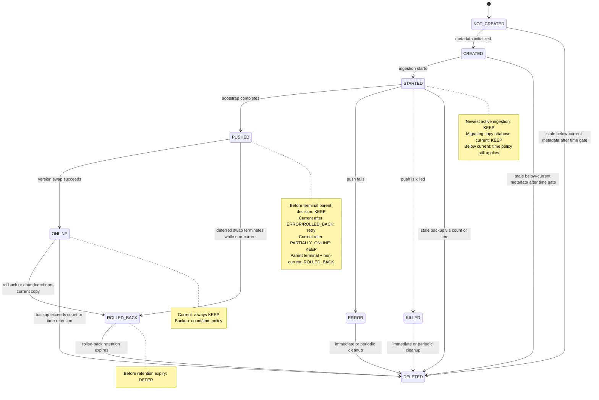

# Version Lifecycle and Deletion

Venice protects versions that may still serve reads or complete an in-flight push, while cleaning
terminal non-current copies by count and time. A version's status alone is not enough to decide deletion:
the controller also considers whether it is current, the newest completed bootstrap (future), a
backup, within configured retention, or part of a store migration.

## Deletion decision table

The count-based sweep is implemented by `Store.retrieveVersionsToDelete`. The time-based sweep is
implemented by `StoreBackupVersionCleanupService`. Deferred version swap terminal transitions first
reconcile bootstrap-complete, non-current child copies to `ROLLED_BACK`, so they cannot remain
invisible to both sweeps.

| Initial status | Role / initial condition | Count retention | Time / safety gate | Trigger | Deletion decision |
| --- | --- | --- | --- | --- | --- |
| Any | Current version | Any | Any | Any cleanup | **KEEP** |
| `NOT_CREATED` or `CREATED` | Non-current version at or above current | Not eligible | Not below current | Any cleanup | **KEEP** |
| `NOT_CREATED` or `CREATED` | Below current before standard cleanup is ready | Not eligible | Minimum/default retention gate not met | Time sweep | **DEFER** |
| `NOT_CREATED` or `CREATED` | Below current after standard cleanup is ready | Not eligible | Minimum delay met with multiple eligible backups, or retention expired | Time sweep | **DELETE** |
| `STARTED` | Newest version (active ingestion) | Protected | Not below current | Any cleanup | **KEEP** |
| `STARTED` | Older version at or above current while store is migrating | Protected during migration | Not below current | Any cleanup | **KEEP** |
| `STARTED` | Below current while migrating, before standard cleanup is ready | Protected during migration | Minimum/default retention gate not met | Time sweep | **DEFER** |
| `STARTED` | Below current while migrating, after standard cleanup is ready | Protected from count only | Minimum delay met with multiple eligible backups, or retention expired | Time sweep | **DELETE** |
| `STARTED` | Older non-current version, store is not migrating | Not protected | Not eligible | Count sweep | **DELETE** |
| `PUSHED` | Non-current version without a terminal parent decision | Excluded because it may be an active deferred or concurrent swap candidate | Not eligible | Count or time cleanup | **KEEP** |
| `PUSHED` or `ONLINE` | Still current in a child after parent `ERROR` or `ROLLED_BACK` | Protected while serving; reconciliation remains incomplete | Not eligible | Parent terminal reconciliation | **DEFER: keep and retry** |
| `PUSHED` or `ONLINE` | Still current in a child after parent `PARTIALLY_ONLINE` | Serving the intentional partial state | Not eligible | Parent terminal reconciliation | **KEEP** |
| `PUSHED` or non-current `ONLINE` | Parent deferred swap becomes `ERROR`, `PARTIALLY_ONLINE`, or `ROLLED_BACK` | Removed from count sweep | Rolled-back retention gate applies | Parent terminal transition | **DEFER: mark `ROLLED_BACK`** |
| `ONLINE` | Backup within the configured preserved count | Within limit | Not considered | Count sweep | **KEEP** |
| `ONLINE` | Backup beyond the configured preserved count | Exceeds limit | Not considered | Count sweep | **DELETE** |
| `ONLINE` | Backup considered by retention cleanup | Not considered | Before minimum retention | Time sweep | **DEFER** |
| `ONLINE` | Backup considered by retention cleanup | Not considered | Routers or servers do not agree on current version | Time sweep | **DEFER** |
| `ONLINE` | Eligible old backup | Not considered | Retention expired and metadata validation passes | Time sweep | **DELETE** |
| `ERROR` or `KILLED` | Non-current version | Not protected | Minimum cleanup safety gate where applicable | Immediate or periodic cleanup | **DELETE** |
| `ROLLED_BACK` | Non-current version | Excluded from count sweep | Before rolled-back retention expires | Time sweep | **DEFER** |
| `ROLLED_BACK` | Non-current version | Excluded from count sweep | Rolled-back retention expired | Time sweep | **DELETE** |

Count-based and time-based cleanup are independent triggers. The first applicable trigger may delete
an eligible backup, but neither trigger may delete the current version. `PUSHED` versions are never
deleted from status and version number alone because multiple deferred or concurrent swaps can be
active. A terminal parent decision explicitly converts bootstrap-complete non-current child copies
to `ROLLED_BACK`. The controller scans every deferred terminal parent version, including versions
superseded by a newer push, and retries while a child is unreachable, missing the target metadata,
in progress, or unexpectedly still current after parent `ERROR` or `ROLLED_BACK`.

When a child copy becomes `ROLLED_BACK`, the controller resets the store-level latest-promotion
timestamp to start the rollback retention window. A subsequent promotion can reset that shared clock
again, so a rolled-back version may be retained longer than the configured duration; it cannot be
deleted immediately because the current version was promoted long before the rollback.

## State machine

## Backup observability

The `ingestion.disk.used` gauge sums disk usage across every local version with the same role, so the
`backup` series represents cumulative backup disk rather than one representative version. The
`ingestion.disk.version_count` gauge reports the number of locally loaded storage engines by
`current`, `future`, and `backup` role. Both metrics use bounded role dimensions rather than a
per-version dimension.
