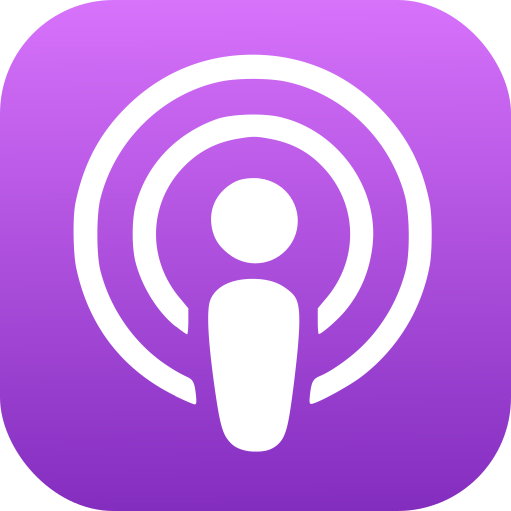
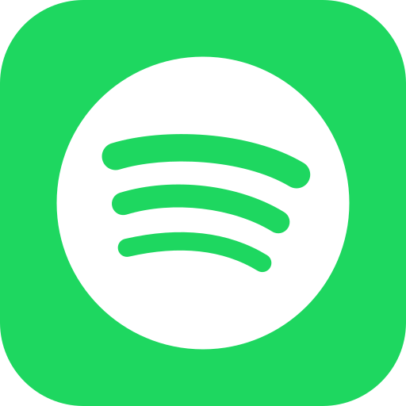

<!--This affects all images of the page, which for now are all icons in the bottom table. If we want other images need in this page, then we may need to refactor this. -->

# Learn More
This page lists the Venice content published online. Please keep in mind that older content reflects an earlier phase of 
the project and may not be entirely correct anymore.

## Posts
The following blog posts have previously been published about Venice:

- 2015: [Prototyping Venice: Derived Data Platform](https://engineering.linkedin.com/distributed-systems/prototyping-venice-derived-data-platform)
- 2017: [Building Venice with Apache Helix](https://engineering.linkedin.com/blog/2017/02/building-venice-with-apache-helix)
- 2017: [Building Venice: A Production Software Case Study](https://engineering.linkedin.com/blog/2017/04/building-venice--a-production-software-case-study)
- 2017: [Venice Hybrid: Doing Lambda Better](https://engineering.linkedin.com/blog/2017/12/venice-hybrid--doing-lambda-better)
- 2018: [Venice Performance Optimization](https://engineering.linkedin.com/blog/2018/04/venice-performance-optimization)
- 2021: [Taming memory fragmentation in Venice with Jemalloc](https://engineering.linkedin.com/blog/2021/taming-memory-fragmentation-in-venice-with-jemalloc)
- 2022: [Supporting large fanout use cases at scale in Venice](https://engineering.linkedin.com/blog/2022/supporting-large-fanout-use-cases-at-scale-in-venice)
- 2022: [Open Sourcing Venice – LinkedIn’s Derived Data Platform](https://engineering.linkedin.com/blog/2022/open-sourcing-venice--linkedin-s-derived-data-platform)
- 2023: [Public CI](https://blog.venicedb.org/public-ci)
- 2023: [Stable Releases](https://blog.venicedb.org/stable-releases)
- 2024: [VeniceCon 2024](https://blog.venicedb.org/venicecon-2024)
- 2024: [Stable Release 0.4.263](https://blog.venicedb.org/stable-release-0-4-263)

Follow us on [HashNode](http://blog.venicedb.org) or [subscribe to the newsletter](https://blog.venicedb.org/newsletter) 
to hear about it when new posts are published.

## Talks
The following talks have been given about Venice:

[//]: # (- 2018: [Venice with Apache Kafka & Samza]&#40;https://www.youtube.com/watch?v=Usz8E4S-hZE&#41;)
- 2019: [People You May Know: Fast Recommendations over Massive Data](https://www.infoq.com/presentations/recommendation-massive-data/)
- 2019: [Enabling next generation models for PYMK Scale](https://www.youtube.com/watch?v=znd-Q6IvCqY)
- 2022: Open Sourcing Venice
  - [Strange Loop 2022](https://www.youtube.com/watch?v=pJeg4V3JgYo) (original)
  - [Big Data Montreal 65](https://www.youtube.com/live/B1aMfE48P0Y?si=BcpRqKSSlWGamAd5&t=3800) (includes Q&A)
- 2023: What is Derived Data? (and Do You Already Have Any?)
  - [QCon London 2023](https://www.infoq.com/presentations/derived-data/) (original)
  - [University lecture at ETS](https://www.youtube.com/watch?v=p1LtVo_1Q7A) (in French, includes Q&A)
- 2023: [Partial Updates in Venice](https://www.youtube.com/watch?v=WlfvpZuIa6Q&t=3880s)
- 2023: [When Only the Last Writer Wins We All Lose: Active-Active Geo-Replication in Venice](https://www.youtube.com/watch?v=jfbg6IUgVlI)
- 2023: [The Journey to a Million Ops / Sec / Node in Venice](https://www.infoq.com/presentations/scalable-low-latency/)
- 2024: Lessons Learned from Building LinkedIn’s AI Data Platform
  - [QCon London 2024](https://www.infoq.com/presentations/ai-venice/) (original)
  - [VeniceCon 2024: part 1](https://www.youtube.com/watch?v=PmjGEXek--s), [part 2](https://www.youtube.com/watch?v=PlCvF9C2RAU)
  - [University lecture at ETS](https://www.youtube.com/watch?v=Vkazja71BkA) (in French, includes Q&A)
- 2024: [TLA+ @ LinkedIn: Ambry and Venice](https://www.youtube.com/watch?v=Jz0J5N77QKk)
- 2024: [What Venice Shipped in the Last Year](https://www.youtube.com/watch?v=5pVUKUvcXyg)
- 2024: [User Stories: Trust and Privacy Filtering using Venice](https://www.youtube.com/watch?v=JMULRvcmRyk)
- 2024: [Fast Client: Venice Next-Gen Read Path](https://www.youtube.com/watch?v=g2FxkEQU4P8)

Follow us on [YouTube](https://www.youtube.com/@venicedb) to hear about it when new content is published on that 
platform.

## Podcasts
The following interviews have been given about Venice:

| Year | Channel                  | Youtube                                                                                                                              | Apple                                                                                                                                                        | Spotify                                                                                                                    |
|------|--------------------------|--------------------------------------------------------------------------------------------------------------------------------------|--------------------------------------------------------------------------------------------------------------------------------------------------------------|----------------------------------------------------------------------------------------------------------------------------|
| 2022 | JUXT Cast                |  |  |  |
| 2022 | SaaS Developer Community |  |                                                                                                                                                              |                                                                                                                            |
| 2023 | Monday Morning Data Chat |  |                   |  |
| 2023 | Software Misadventures   |  |                     |  |
| 2024 | The Geek Narrator        |  |                           |  |
| 2025 | InfoQ                    |  |                          |                            |

